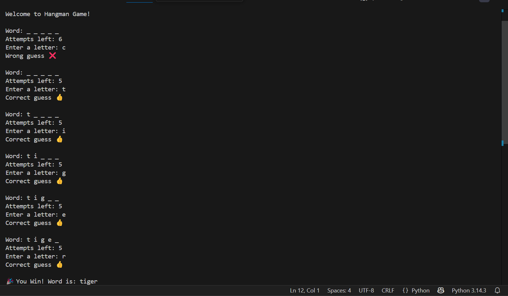
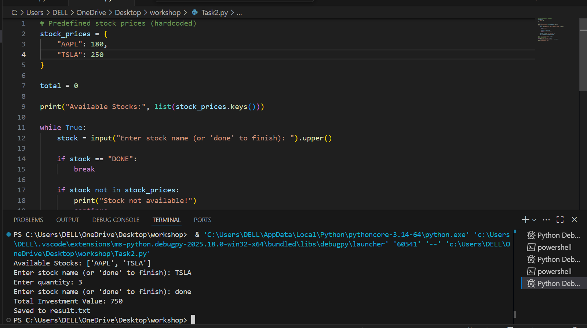

# Hangman Game (Python)

This is a simple text-based Hangman game developed using Python.

## 📌 Features
- Random word selection
- User guesses letters
- Limited attempts (6 chances)

## ▶️ How to Run
1. Open the file in VS Code
2. Run the program
3. Enter letters to guess the word

## 📸 Output

## 🚀 Author
Lakshmilavanya

# Stock Portfolio Tracker (Python)

This project is a simple stock portfolio tracker developed using Python. It allows users to input the quantity of stocks they own and calculates the total investment value based on predefined stock prices.

## 📌 Features
- User can enter stock quantities
- Calculates total investment value
- Simple and beginner-friendly program

## 🧠 Concepts Used
- User Input
- Variables
- Arithmetic Operations

## ▶️ How to Run
1. Open the file in VS Code or any Python IDE
2. Run the program
3. Enter stock quantities when prompted
4. View the total investment value

## 📸 Output

## 🚀 Author
Lakshmilavanya
